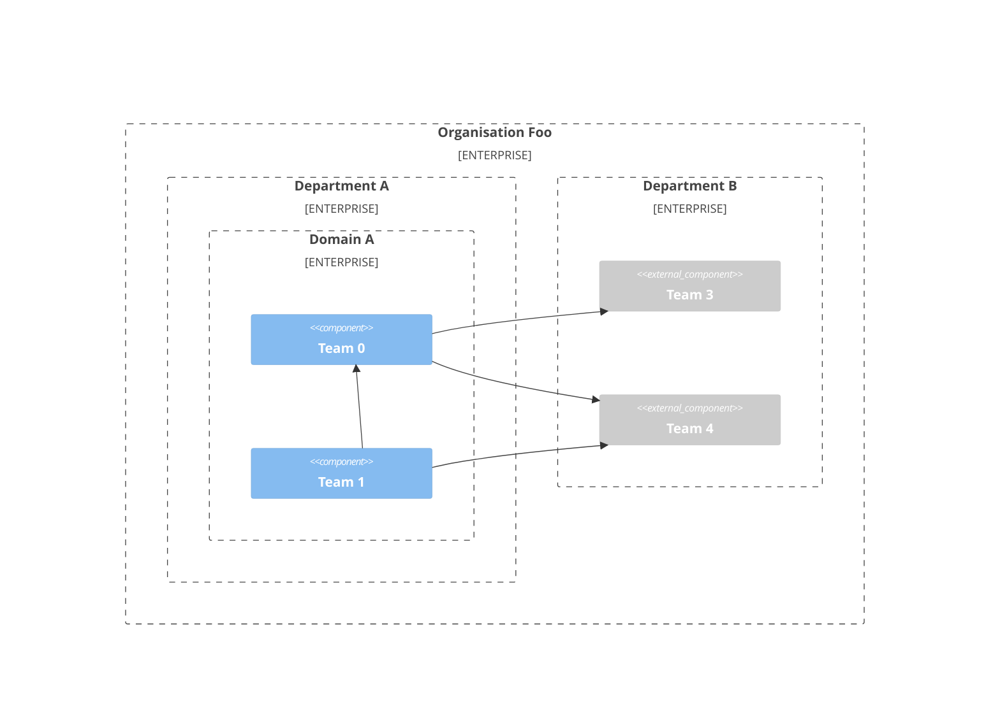
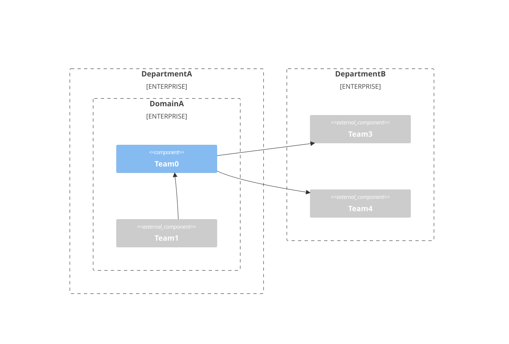
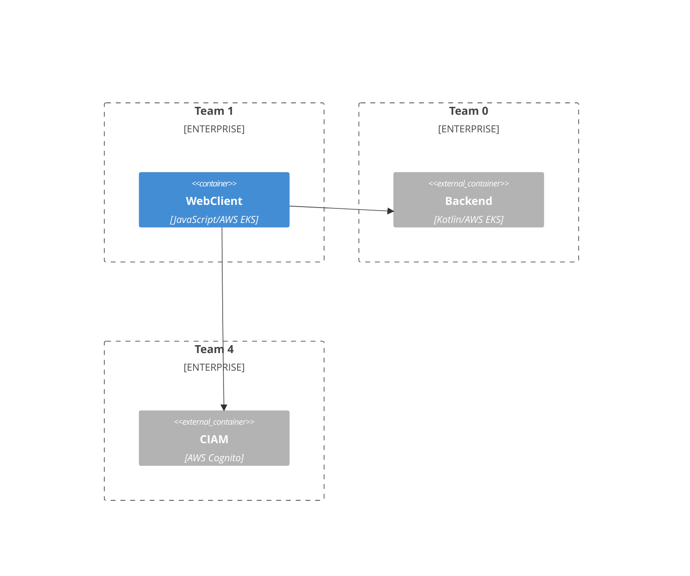
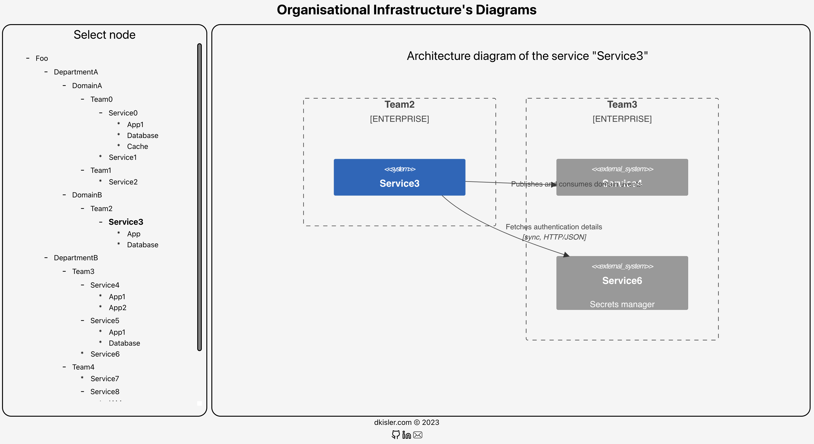

# Architecture diagrams with dynamically-adjustable level of details

The tool to facilitate understanding of complex systems using C4 model diagrams with dynamically-adjustable
level of details.

## Transitions

The contextual topology is illustrated below.

```commandline
organisation
|-- department 0
|   |-- domain 0.0
|   |   |-- team 0.0.0
|   |   |   |-- system 0.0.0
|   |   |   |   |-- container 0.0.0
|   |   |   |   |-- container 0.0.1
|   |   |   |   |   ...
|   |   |   |   `-- container 0.0.P
|   |   |   |-- system 0.0.1
|   |   |   |   ...
|   |   |   `-- system 0.0.L
|   |   |-- team 0.0.1
|   |   |   ...
|   |   `-- team 0.0.K
|   |-- domain 0.1
|   |   ...
|   `-- domain 0.M
|-- department 1
|   ...
`-- department N
```

The context transitions from the _organisation_ level down to the _system_ level. The diagram of every level includes the
nodes which belong to selected level's node and the linked nodes from other levels. 

### Example

**GIVEN**

- The organisation _Foo_ contains of two departments: _DepartmentA_ and _DepartmentB_.
- The _DepartmentA_ has two domains: _DomainA_ and _DomainB_.
- The _DomainA_ consists of three teams: _Team0_ (backend), _Team1_ (frontend).
- The _DomainB_ has one team: _Team2_ (analytics and reconciliation).
- The _DepartmentB_ has two teams: _Team3_ (streaming platform) and _Team4_ (CIAM).
- The _Team0_ has one outbound dependency: _Team1_, and two inbound dependencies: _Team3_ and _Team4_. 
- The _Team1_ has two inbound dependencies: _Team0_ and _Team4_.
- The _Team2_ has one dependency: _Team3_.
- The _Team3_ has three dependencies: _Team0_, _Team2_ and _Team4_.
- The _Team4_ has three outbound dependencies: _Team0_, _Team1_ and _Team3_, and one inbound dependency: _Team3_.
- The _Team0_ owns two services: _Service0_ and _Service1_.
- The _Team1_ owns one service: _Service2_.
- The _Team2_ owns one service: _Service3_.
- The _Team3_ owns three services: _Service4_, _Service5_ and _Service6_.
- The _Team4_ owns three services: _Service7_, _Service8_ and _Service9_.
- _Service0_ consists of three containers:
  - _App1_: _Kotlin_ application deployed as AWS EKS;
  - _Database_: AWS Aurora Postgres.
  - _Cache_: AWS Elasticache Redis.
- _Service1_ is a _Kotlin_ application to run batch jobs on database.
- _Service2_ is a _JavaScript_ application deployed to AWS EKS.
- _Service3_ consists of two containers:
  - _App_: _Python_ batch processing app deployed to AWS EKS;
  - _Database_: analytics db AWS Redshift.
- _Service4_ consists of three containers:
  - _App1_: _Kafka_ deployed as AWS MSK; 
  - _App2_: _Schema Registry_ deployed as _AWS Glue Schema Registry_;
- _Service5_ consists of three containers:
  - _App1_: Go application to sync domain events data to datalake deployed to AWS EKS;
  - _Database_: S3 bucket.
- _Service6_: secrets manager deployed as AWS Secretsmanager.
- _Service7_: is a Go application to mutate user's account deployed to AWS EKS;
- _Service8_ consists of four containers:
  - _IAM_: AWS Cognito;
  - _l0_: Go application deployed as AWS Lambda for AWS Cognito trigger 1;
  - _l1_: Go application deployed as AWS Lambda for AWS Cognito trigger 2;
  - _l2_: Go application deployed as AWS Lambda for AWS Cognito trigger 3;
- _Service9_ is AWS SES used as the email notification service.

#### Test Scenario - Domain Level

**WHEN**

- _Domain_ context level is set
- _DomainA_ is selected

**THEN**

The following diagram is expected.





#### Test Scenario - Container Level

**WHEN**

- _Application_ context level is set
- _WebClient Application_ is selected

**THEN**

The following diagram is expected.



## Demo

The screenshot illustrates the tool in action by visualising the infrastructure defined in the [file](src/data.json). 


