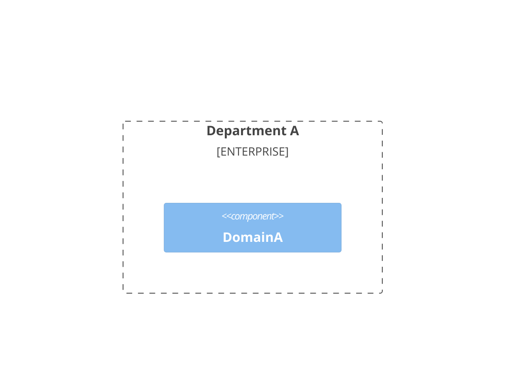
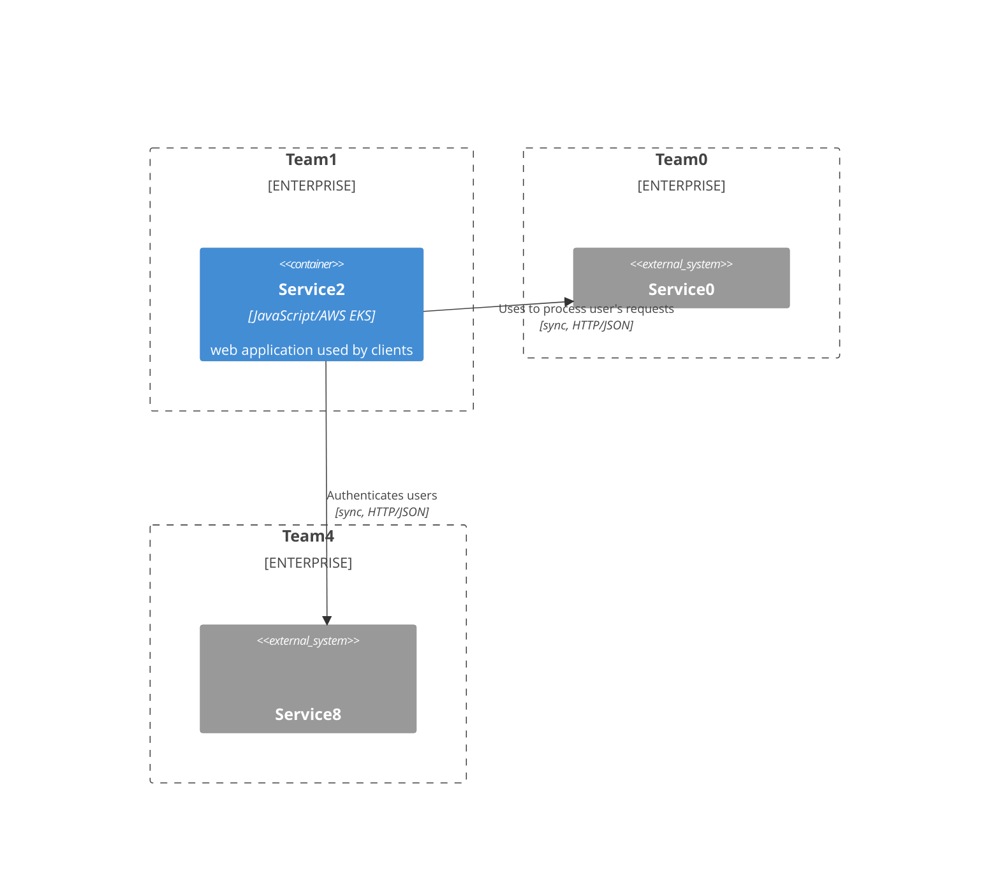

# `org-infrastructure-overview`: organisation infrastructure's architecture overview with dynamically-adjustable level of details

`org-infrastructure-overview` is the tool aiming to facilitate understanding dependencies between complex systems
across (sub-)organisations using [C4 model](https://c4model.com/) diagrams with dynamically-adjustable level of details.
It illustrates inter-domains interactions spanning several teams and services based on their definition as
the [graph](graph-schema.json).

## Contents

* [Demo](#demo)
* [How to run](#how-to-run)
    + [Prerequisites](#prerequisites)
    + [Commands](#commands)
* [How to define graph](#how-to-define-graph)
* [Contribution](#contribution)
  + [Further development](#further-development)

## Demo

The screenshot illustrates the tool in action by visualising the infrastructure defined in the [file](src/data.json).


<details>
<summary><strong>Demo topology</strong></summary>

The demo application is based on the demo org structure topology described below.

**GIVEN**

- The organisation _Foo_ contains of two departments: _DepartmentA_ and _DepartmentB_.
- The _DepartmentA_ has two domains: _DomainA_ and _DomainB_.
- The _DomainA_ consists of three teams: _Team0_ (backend), _Team1_ (frontend).
- The _DomainB_ has one team: _Team2_ (analytics and reconciliation).
- The _DepartmentB_ has two teams: _Team3_ (streaming platform) and _Team4_ (CIAM).
- The _Team0_ has one outbound dependency: _Team1_, and two inbound dependencies: _Team3_ and _Team4_.
- The _Team1_ has two inbound dependencies: _Team0_ and _Team4_.
- The _Team2_ has one dependency: _Team3_.
- The _Team3_ has three dependencies: _Team0_, _Team2_ and _Team4_.
- The _Team4_ has three outbound dependencies: _Team0_, _Team1_ and _Team3_, and one inbound dependency: _Team3_.
- The _Team0_ owns two services: _Service0_ and _Service1_.
- The _Team1_ owns one service: _Service2_.
- The _Team2_ owns one service: _Service3_.
- The _Team3_ owns three services: _Service4_, _Service5_ and _Service6_.
- The _Team4_ owns three services: _Service7_, _Service8_ and _Service9_.
- _Service0_ consists of three containers:
    - _App1_: _Kotlin_ application deployed as AWS EKS;
    - _Database_: AWS Aurora Postgres.
    - _Cache_: AWS Elasticache Redis.
- _Service1_ is a _Kotlin_ application to run batch jobs on database.
- _Service2_ is a _JavaScript_ application deployed to AWS EKS.
- _Service3_ consists of two containers:
    - _App_: _Python_ batch processing app deployed to AWS EKS;
    - _Database_: analytics db AWS Redshift.
- _Service4_ consists of three containers:
    - _App1_: _Kafka_ deployed as AWS MSK;
    - _App2_: _Schema Registry_ deployed as _AWS Glue Schema Registry_;
- _Service5_ consists of three containers:
    - _App1_: Go application to sync domain events data to datalake deployed to AWS EKS;
    - _Database_: S3 bucket.
- _Service6_: secrets manager deployed as AWS Secretsmanager.
- _Service7_: is a Go application to mutate user's account deployed to AWS EKS;
- _Service8_ consists of four containers:
    - _IAM_: AWS Cognito;
    - _l0_: Go application deployed as AWS Lambda for AWS Cognito trigger 1;
    - _l1_: Go application deployed as AWS Lambda for AWS Cognito trigger 2;
    - _l2_: Go application deployed as AWS Lambda for AWS Cognito trigger 3;
- _Service9_ is AWS SES used as the email notification service.

**Note** that the above description is stored as the [graph definition](src/data.json) for the tool.

#### Test Scenario - Domain Level

**WHEN**

_DomainA_ is selected

**THEN**

The following diagram is expected.



#### Test Scenario - Container Level

**WHEN**

_Service2_ is selected

**THEN**

The following diagram is expected.



</details>

## How to run

### Prerequisites

- Node.js v18.16+

### Commands

Run to setup:

```commandline
npm install
```

Run to test:

```commandline
npm run test
```

Run to launch a dev server:

```commandline
npm run dev
```

Run to build:

```commandline
npm run build
```

## How to define graph

**The graph definition rules**:

- The graph must be defined according to the [JSON schema](graph-schema.json).
- Each element in the graph is referred to as a `node`.
- Dependencies between nodes are defined by `links`.
- Every `link` represents a dependency, not data flow. The attribute **_from_** denotes the ID of the node
  dependent on the `node` denoted by the attribute **_to_**.
- The `node` ID is defined as a Unix path, which includes the IDs of the node's parent and the parent of its parent
  and so on recursively.
- The `node` ID is defined by using the names of the node and its parents. All special characters and spaces are
  removed, and the results are concatenated using the forward slash sign (`/`) as the separator.

<details>
<summary><strong>The contextual topology</strong></summary>

```commandline
organisation 0
|-- department 0/0
|   |-- domain 0/0/0
|   |   |-- team 0/0/0/0
|   |   |   |-- service 0/0/0/0/0
|   |   |   |   |-- application 0/0/0/0/0/0
|   |   |   |   |-- application 0/0/0/0/0/1
|   |   |   |   |   ...
|   |   |   |   |-- queue 0/0/0/0/0/2
|   |   |   |   `-- database 0/0/0/0/0/P
|   |   |   |-- service 0/0/0/0/1
|   |   |   |   ...
|   |   |   `-- service 0/0/0/0/L
|   |   |-- team 0/0/0/1
|   |   |   `-- application 0/0/0/1/0
|   |   |   ...
|   |   `-- team 0/0/0/K
|   |-- domain 0/1
|   |   ...
|   |-- domain 0/X
|   |   `-- application 0/X/0
|   |   ...
|   `-- domain 0/M
|-- department 0/1
|   ...
|-- team 0/R
|   ...
|-- department 0/Y
|   `-- database 0/Y/0
|   ...
|-- department 0/Z
|   `-- team 0/Z/0
|   ...
`-- department 0/N
```

The context transitions from the _organisation_ level down to the _system_ level. The diagram of every level includes
the nodes which belong to selected level's node and the linked nodes from other levels.

</details>

<details>
<summary><strong>Graph definition example</strong></summary>

**GIVEN**

- Two business domains _DomainA_ and _DomainB_ belong to the same business unit _Unit0_;
- _DomainA_ updates the entity based on the domain events emitted by the _DomainB_;
- Both domains communicate via the _Platform0_ by publishing and consuming domain events.

**WHEN**

The given topology is intended to be illustrated using the `org-infrastructure-overview` tool.

**THEN**

The following graph shall be expected:

```json
{
  "nodes": [
    {
      "name": "Unit0",
      "type": "department",
      "nodes": [
        {
          "name": "DomainA",
          "type": "domain"
        },
        {
          "name": "DomainB",
          "type": "domain"
        }
      ]
    },
    {
      "name": "Platform0",
      "type": "service"
    }
  ],
  "links": [
    {
      "from": "Unit0/DomainA",
      "to": "Unit0/DomainB",
      "description": "Uses to update the entity state"
    },
    {
      "from": "Unit0/DomainA",
      "to": "Platform0",
      "description": "Publishes and consumes domain events"
    },
    {
      "from": "Unit0/DomainB",
      "to": "Platform0",
      "description": "Publishes and consumes domain events"
    }
  ]
}
```

</details>

## Contribution

The codebase is distributes under the MIT license. Please feel free to open PR, or issue with your request.

### Further development

Given that the organisations which would benefit from the tool use [spotify backstage](https://backstage.io/),
or [opslevel](https://www.opslevel.com/), it would make sense to integrate the tool's logic as plugins to the mentioned
systems.
